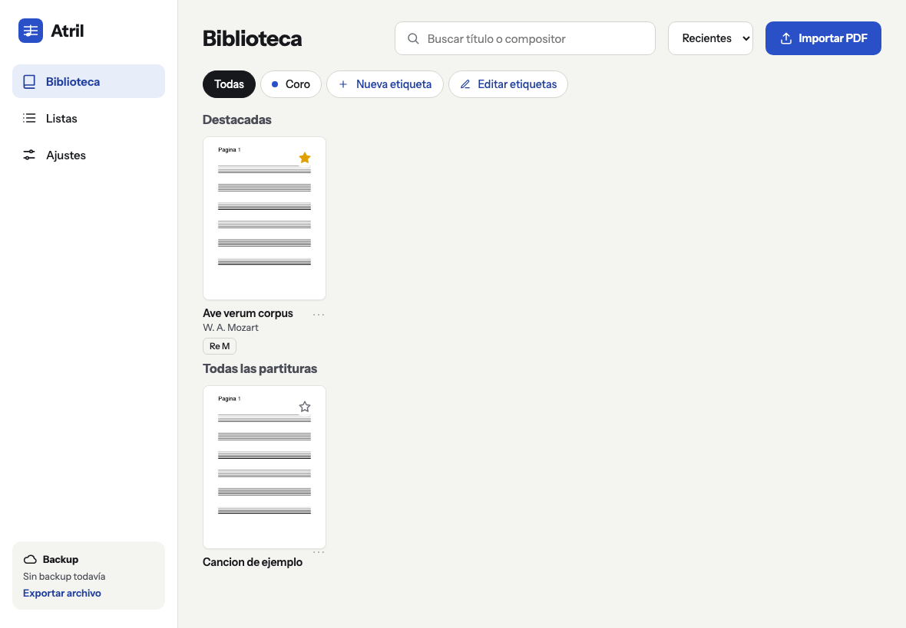
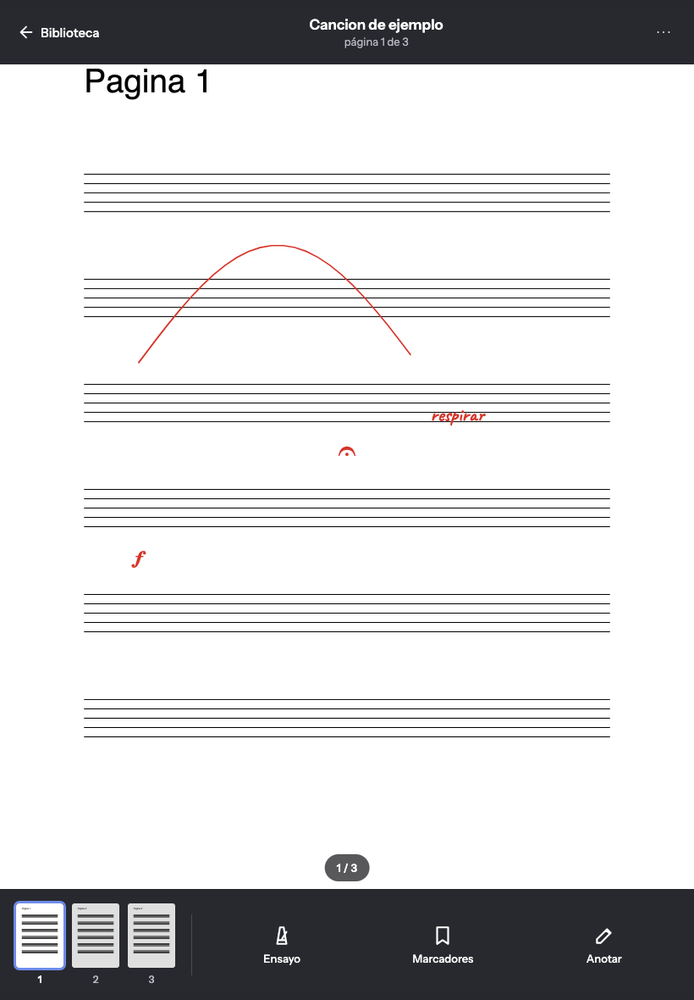
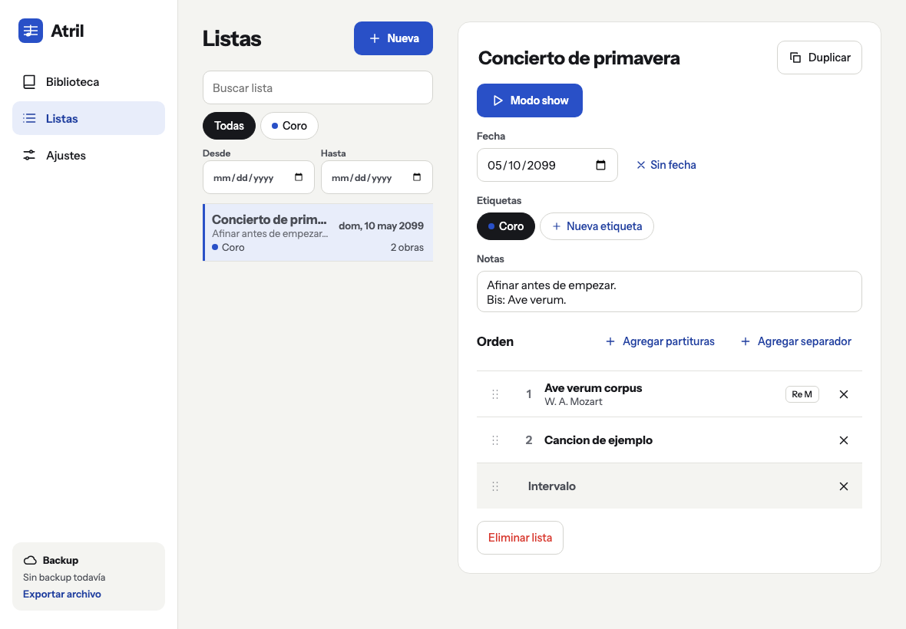
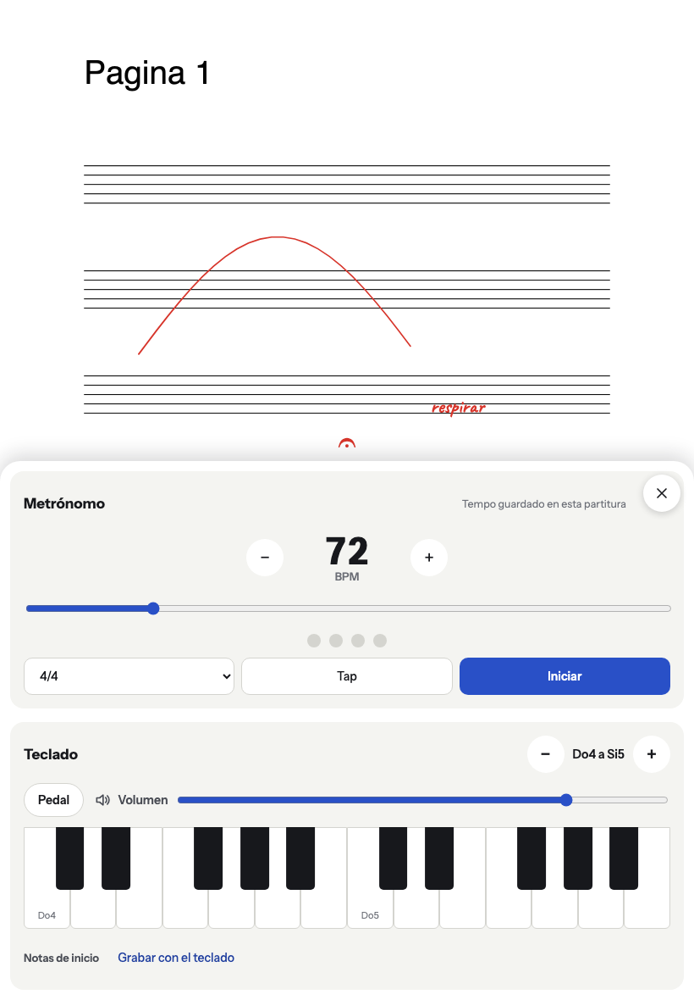

[English](README.md) · **Español**

# Atril

Lector de partituras en PDF para tablet y celular, pensado para coro, banda y estudio. Abrís tus
PDFs, los leés a pantalla completa, los anotás con lápiz o con el dedo, armás listas para
ensayos y conciertos, y tenés metrónomo y un teclado para dar el tono.

Es una app web instalable (PWA): se instala desde el navegador, funciona sin conexión y no tiene
servidor. Tus partituras y anotaciones quedan solo en tu dispositivo. Sin cuenta, sin
publicidad, gratis.

**Abrila en https://keykor.github.io/atril/** e instalala desde ahí (ver
[Instalarla](#instalarla)). La app está en español y en inglés y sigue el idioma del dispositivo;
lo cambiás en Ajustes → Idioma. Las notas pueden verse como Do Re Mi o C D E, el cifrado que
uses, sin importar el idioma.

| Biblioteca                                                                   | Lector con anotaciones                                                        |
| ---------------------------------------------------------------------------- | ----------------------------------------------------------------------------- |
|  |  |

| Listas                                                                            | Herramientas de ensayo                           |
| --------------------------------------------------------------------------------- | ------------------------------------------------ |
|  |  |

## Qué hace

- **Biblioteca:** importás PDFs (en Android también desde "Compartir"), los buscás por título o
  compositor, los organizás con etiquetas de colores y destacás con una estrella los que más
  usás. Cada partitura guarda tonalidad, tempo, compás y notas de inicio.
- **Lector:** una página por pantalla, scroll vertical o dos páginas lado a lado. Media página
  para pasar sin perder el lugar, temas claro, sepia y oscuro, recorte de márgenes para que la
  música se vea más grande, y la pantalla no se apaga mientras leés. También anda con un pedal
  Bluetooth.
- **Orden de páginas:** repetís o reordenás páginas sin tocar el PDF. "1, 2, 3, 2, 3, 4" hace una
  repetición sin ir y volver.
- **Anotaciones:** lápiz, resaltador, texto, goma y símbolos musicales (figuras, silencios,
  alteraciones, dinámicas y articulaciones) que se pegan con un toque. El PDF original nunca se
  modifica.
- **Marcadores y saltos:** marcás un lugar ("Letra B") y saltás directo ahí. Los saltos son
  botones sobre la página para D.S., coda y repeticiones.
- **Listas y modo show:** armás el orden de un concierto con separadores, fecha, etiquetas y
  notas. Filtrás las listas por nombre, etiqueta o fechas, duplicás una para otro día y la
  recorrés obra por obra sin salir del lector. En modo show la barra de abajo arranca bloqueada
  para no tocar nada sin querer.
- **Ensayo:** metrónomo y teclado de dos octavas con pedal y volumen. Grabás una vez las notas de
  inicio de cada obra y las das con un toque antes de empezar.
- **Imprimir o compartir:** exportás un PDF con la partitura original y encima lo que dibujaste,
  escribiste y los símbolos que pegaste.
- **Backup:** exportás todo en un archivo `.atril`, o conectás tu Google Drive para que se guarde
  solo.

## Cómo se usa el lector

En la app, Ajustes → Cómo se usa muestra cada función en su lugar.

| Gesto                                          | Leyendo                                                   | Anotando                                                  |
| ---------------------------------------------- | --------------------------------------------------------- | --------------------------------------------------------- |
| Toque en el tercio derecho o izquierdo         | Avanza o retrocede                                        | Dibuja                                                    |
| Toque al centro                                | Muestra u oculta las barras                               | —                                                         |
| Deslizar de costado                            | Pasa la hoja (con zoom, al llegar al borde de la página)  | —                                                         |
| Pellizco                                       | Zoom                                                      | Zoom                                                      |
| Doble toque al centro (o ⋯ → Ajuste de página) | Alterna ajuste al ancho y a página entera, y saca el zoom | —                                                         |
| Apoyar el lápiz                                | Empieza a anotar                                          | Dibuja                                                    |
| Dos dedos                                      | —                                                         | Mueven la página y hacen zoom; tocar sin moverlos deshace |
| Flechas, PageUp/PageDown, espacio              | Pasan página (sirve para pedales Bluetooth)               | —                                                         |

## Instalarla

- **Android (Chrome):** Ajustes de Atril → Instalar, o el menú del navegador → "Instalar app".
- **iPhone y iPad (Safari):** botón Compartir → "Agregar a inicio". Importá las partituras desde
  la app instalada: en iOS no comparte lo guardado con Safari.

Hacé un backup de vez en cuando: iOS puede borrar los datos de las apps web si le falta espacio.
Atril te lo recuerda cada 7 días, y con Google Drive conectado se guarda solo después de cada
cambio.

## Privacidad

Todo vive en el almacenamiento del navegador, en tu dispositivo. Atril no tiene servidor y no
junta datos. El único servicio externo es Google Drive, solo si lo conectás, y Atril ve
únicamente los archivos que crea ahí.

## Desarrollo

Requiere Node 22 o más nuevo.

```bash
npm install
npm run dev          # servidor de desarrollo
npm run lint         # ESLint + Prettier
npm test             # tests unitarios (Vitest)
npm run e2e          # tests de punta a punta (Playwright, Chromium y WebKit)
npm run build        # build de producción en dist/
```

La primera vez, antes de `npm run e2e`: `npx playwright install chromium webkit`.

React 19 + TypeScript sobre Vite, pdf.js para renderizar, IndexedDB (Dexie) para guardar y Web
Audio para el sonido. Los textos de la interfaz están en `src/app/strings.ts` (español) y
`src/app/strings.en.ts` (inglés); si falta uno en cualquiera de los dos, no compila.

Cómo está armado el código, el modelo de datos y por qué se tomó cada decisión:
[`docs/arquitectura.md`](docs/arquitectura.md). Las reglas para contribuir (ramas, commits,
qué requiere revisión) están en [`CLAUDE.md`](CLAUDE.md), que leen tanto personas como agentes.

### Publicación

El trabajo se integra primero en `test` y después pasa a `main`. Cada push a `main` corre lint y
tests y publica en GitHub Pages (`.github/workflows/ci.yml`).

Quien ya tiene la app abierta o instalada ve "Hay una versión nueva de Atril" en la biblioteca y
la aplica con un toque. Nunca se actualiza sola en medio de una lectura. La versión y la fecha
de publicación están en Ajustes.

### Backup en Google Drive (opcional)

1. En Google Cloud Console creá un cliente OAuth de tipo "Aplicación web" y agregá
   `https://keykor.github.io` (y `http://localhost:5173` para desarrollo) a los orígenes de
   JavaScript autorizados.
2. Habilitá la API de Google Drive en ese proyecto.
3. Guardá el client ID como variable de repositorio `VITE_GOOGLE_CLIENT_ID` (Settings → Secrets
   and variables → Actions → Variables). En local va en `.env.local`.

Sin esa variable la sección de Drive aparece deshabilitada y el resto funciona igual.

## Créditos

Los símbolos musicales usan la fuente [Bravura](https://github.com/steinbergmedia/bravura) de
Steinberg, bajo la licencia SIL Open Font License 1.1.
