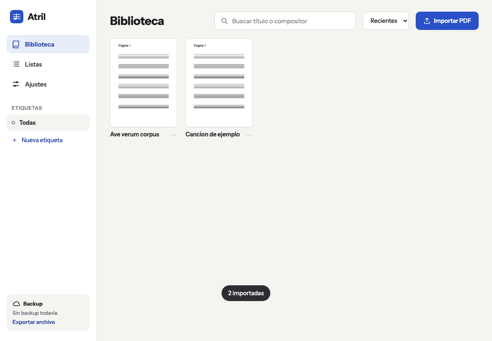
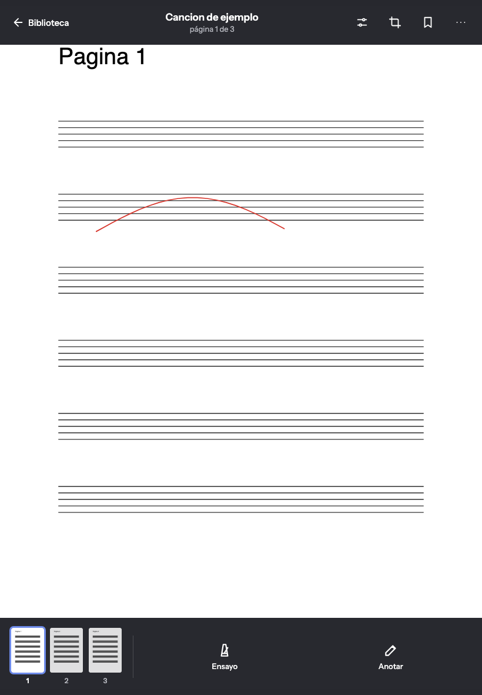

# Atril

Lector de partituras en PDF para tablet y celular, pensado para coro, banda y estudio. Abre tus
PDFs, se leen a pantalla completa, se anotan con lápiz o dedo, se arman listas para ensayos y
conciertos, y trae metrónomo y un teclado para dar el tono.

Es una app web instalable (PWA): se instala desde el navegador, funciona sin conexión y no tiene
servidor. Tus partituras y anotaciones quedan solo en tu dispositivo.

**Usala en:** https://keykor.github.io/atril/

| Biblioteca                                                                  | Lector                                                                   |
| --------------------------------------------------------------------------- | ------------------------------------------------------------------------ |
|  |  |

## Qué hace

- **Biblioteca:** importás PDFs (en Android también desde "Compartir"), los buscás por título o
  compositor y los organizás con etiquetas.
- **Lector:** una página por pantalla, scroll vertical o dos páginas lado a lado; media página
  para pasar sin cortar; temas claro, sepia y oscuro; la pantalla no se apaga mientras leés.
- **Anotaciones:** lápiz, resaltador, texto, goma y símbolos musicales (figuras, silencios,
  alteraciones, dinámicas y articulaciones) que se pegan con un toque. El PDF nunca se modifica.
- **Marcadores y saltos:** marcás un lugar ("Letra B") y saltás ahí; los saltos sirven para
  D.S., coda y repeticiones.
- **Listas y modo show:** armás el orden de un concierto con separadores y lo recorrés de una
  obra a la siguiente sin salir del lector.
- **Ensayo:** metrónomo y teclado de dos octavas; las notas de inicio de cada obra quedan
  guardadas para dar el tono con un toque.
- **Backup:** exportás todo en un archivo `.atril`, o lo conectás a tu Google Drive para que se
  guarde solo.

## Cómo se usa el lector

| Gesto                                        | Leyendo                                                   | Anotando                                                  |
| -------------------------------------------- | --------------------------------------------------------- | --------------------------------------------------------- |
| Toque en el tercio derecho o izquierdo       | Avanza o retrocede                                        | Dibuja                                                    |
| Toque al centro                              | Muestra u oculta las barras                               | —                                                         |
| Deslizar de costado                          | Pasa la hoja (con zoom, al llegar al borde de la página)  | —                                                         |
| Pellizco                                     | Zoom                                                      | Zoom                                                      |
| Doble toque al centro (o el botón de ajuste) | Alterna ajuste al ancho y a página entera, y saca el zoom | —                                                         |
| Apoyar el lápiz                              | Empieza a anotar                                          | Dibuja                                                    |
| Dos dedos                                    | —                                                         | Mueven la página y hacen zoom; tocar sin moverlos deshace |
| Flechas, PageUp/PageDown, espacio            | Pasan página (sirve para pedales Bluetooth)               | —                                                         |

## Instalarla

- **Android (Chrome):** Ajustes de Atril → Instalar, o el menú del navegador → "Instalar app".
- **iPhone y iPad (Safari):** botón Compartir → "Agregar a inicio". Importá las partituras
  desde la app instalada: en iOS no comparte lo guardado con Safari.

Hacé un backup de vez en cuando: iOS puede borrar los datos de las apps web si le falta espacio.
Atril te lo recuerda cada 7 días.

## Desarrollo

Requiere Node 22 o más nuevo.

```bash
npm install
npm run dev          # servidor de desarrollo
npm run lint         # ESLint + Prettier
npm test             # tests unitarios (Vitest)
npm run e2e          # tests de punta a punta (Playwright, Chromium y WebKit)
npm run build        # build de producción en dist/
```

La primera vez, antes de `npm run e2e`: `npx playwright install chromium webkit`.

Cómo está armado el código, el modelo de datos y por qué se tomó cada decisión:
[`docs/arquitectura.md`](docs/arquitectura.md). Las reglas para contribuir (ramas, commits,
qué requiere revisión) están en [`CLAUDE.md`](CLAUDE.md), que leen tanto personas como agentes.

## Publicación

Cada push a `main` corre lint y tests y publica en GitHub Pages
(`.github/workflows/ci.yml`). El trabajo se integra primero en `test` y después pasa a `main`.

Quien ya tiene la app abierta o instalada ve "Hay una versión nueva de Atril" en la biblioteca y
la aplica con un toque. Nunca se actualiza sola en medio de una lectura. La versión y la fecha
de publicación están en Ajustes.

## Backup en Google Drive (opcional)

1. En Google Cloud Console creá un cliente OAuth de tipo "Aplicación web" y agregá
   `https://keykor.github.io` (y `http://localhost:5173` para desarrollo) a los orígenes de
   JavaScript autorizados.
2. Habilitá la API de Google Drive en ese proyecto.
3. Guardá el client ID como variable de repositorio `VITE_GOOGLE_CLIENT_ID` (Settings → Secrets
   and variables → Actions → Variables). En local va en `.env.local`.

Sin esa variable la sección de Drive aparece deshabilitada y el resto funciona igual.

## Créditos

Los símbolos musicales usan la fuente [Bravura](https://github.com/steinbergmedia/bravura) de
Steinberg, bajo la licencia SIL Open Font License 1.1.
