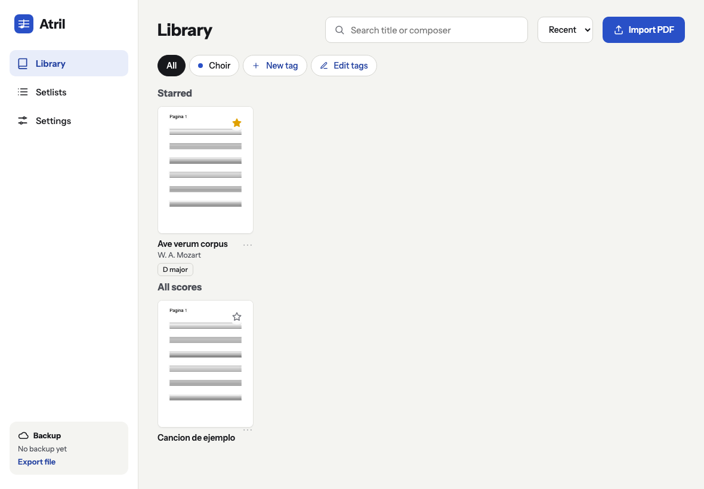
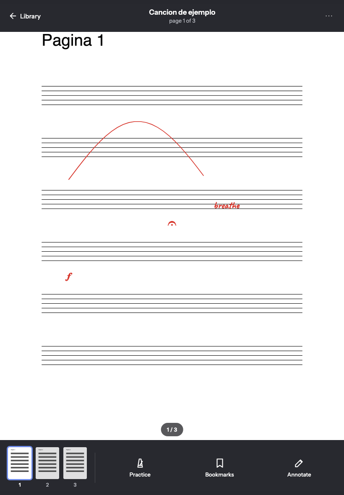
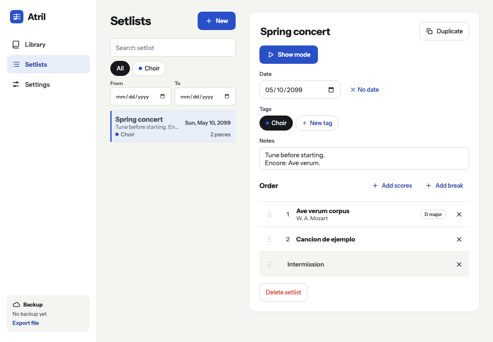
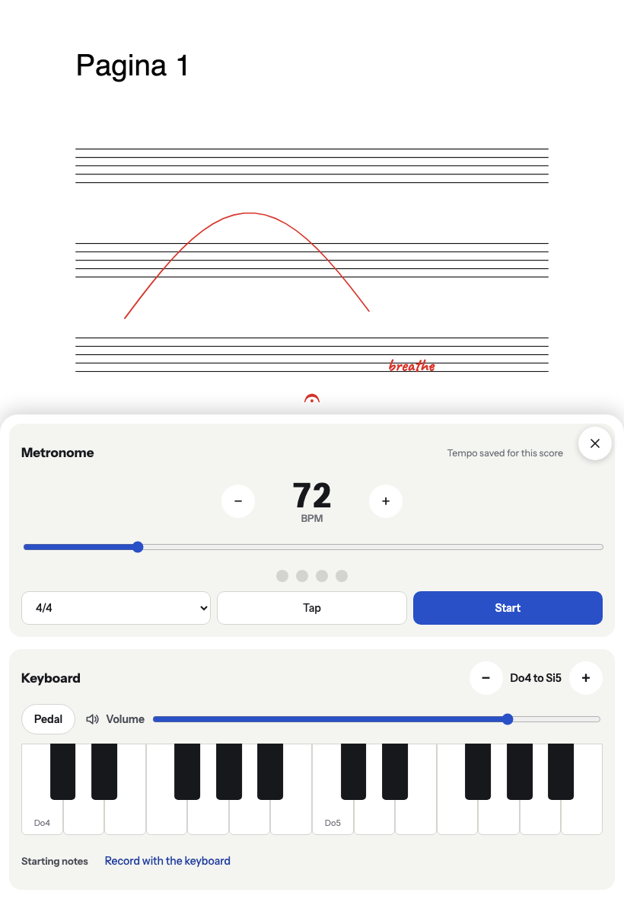

**English** · [Español](README.es.md)

# Atril

A sheet music reader for tablets and phones, made for choirs, bands and practice. Open your PDF
scores, read them full screen, mark them up with a pencil or your finger, build setlists for
rehearsals and concerts, and use the built-in metronome and keyboard to find your pitch.

Atril is an installable web app (PWA). You install it from the browser, it works offline and
there is no server: your scores and annotations stay on your device. No account, no ads, free.

**Open it at https://keykor.github.io/atril/** and install it from there (see
[Install it](#install-it)). The app is in English and Spanish and follows your device's language;
you can change it in Settings → Language.

| Library                                                          | Reader with annotations                                                      |
| ---------------------------------------------------------------- | ---------------------------------------------------------------------------- |
|  |  |

| Setlists                                                                    | Practice tools                                      |
| --------------------------------------------------------------------------- | --------------------------------------------------- |
|  |  |

## What it does

- **Library:** import PDFs (on Android, also from "Share"), search by title or composer, sort
  them with colored tags and star the ones you use most. Each score keeps its key, tempo, time
  signature and starting notes.
- **Reader:** one page per screen, vertical scroll or two pages side by side. Half-page turns so
  you never lose your place, light, sepia and dark themes, crop margins so the music looks
  bigger, and the screen stays on while you read. A Bluetooth page-turner pedal works too.
- **Page order:** repeat or reorder pages without touching the PDF. "1, 2, 3, 2, 3, 4" plays a
  repeat without flipping back.
- **Annotations:** pencil, highlighter, text, eraser and music symbols (notes, rests,
  accidentals, dynamics and articulations) that you place with one tap. The original PDF is
  never modified.
- **Bookmarks and jumps:** mark a spot ("Letter B") and jump straight to it. Jumps are buttons on
  the page for D.S., coda and repeats.
- **Setlists and show mode:** put a concert in order with breaks, a date, tags and notes. Filter
  setlists by name, tag or dates, duplicate one for another day, and step through it piece by
  piece without leaving the reader. In show mode the bottom bar starts locked so you don't tap
  anything by accident.
- **Practice:** a metronome and a two-octave keyboard with sustain pedal and volume. Record
  each piece's starting notes once and play them with one tap before you start.
- **Print or share:** export a PDF of the original score with your drawings, text and symbols
  on top.
- **Backup:** export everything to an `.atril` file, or connect your Google Drive so it backs up
  by itself.

## How the reader works

In the app, Settings → How to use shows each feature right where it is.

| Gesture                                 | Reading                                                | Annotating                                          |
| --------------------------------------- | ------------------------------------------------------ | --------------------------------------------------- |
| Tap the right or left third             | Next or previous page                                  | Draws                                               |
| Tap the center                          | Shows or hides the bars                                | —                                                   |
| Swipe sideways                          | Turns the page (when zoomed, at the page edge)         | —                                                   |
| Pinch                                   | Zoom                                                   | Zoom                                                |
| Double tap the center (or ⋯ → Page fit) | Switches between fit width and whole page, resets zoom | —                                                   |
| Touch with the pencil                   | Starts annotating                                      | Draws                                               |
| Two fingers                             | —                                                      | Move the page and zoom; a tap without moving undoes |
| Arrow keys, PageUp/PageDown, space      | Turn pages (Bluetooth pedals send these)               | —                                                   |

## Install it

- **Android (Chrome):** Atril's Settings → Install, or the browser menu → "Install app".
- **iPhone and iPad (Safari):** Share button → "Add to Home Screen". Import your scores from the
  installed app: on iOS it doesn't share its data with Safari.

Back up now and then: iOS may delete web app data when the device runs low on storage. Atril
reminds you every 7 days, and with Google Drive connected it backs up after every change.

## Privacy

Everything lives in your browser's storage on your device. Atril has no server and collects no
data. The only outside service is Google Drive, only if you connect it, and Atril can only see
the files it creates there.

## Development

Requires Node 22 or newer.

```bash
npm install
npm run dev          # development server
npm run lint         # ESLint + Prettier
npm test             # unit tests (Vitest)
npm run e2e          # end-to-end tests (Playwright, Chromium and WebKit)
npm run build        # production build in dist/
```

The first time, before `npm run e2e`: `npx playwright install chromium webkit`.

React 19 + TypeScript on Vite, pdf.js for rendering, IndexedDB (Dexie) for storage and Web Audio
for sound. Interface text lives in `src/app/strings.ts` (Spanish) and `src/app/strings.en.ts`
(English); TypeScript won't build if a string is missing in either one.

The developer docs are in Spanish: how the code is organized, the data model and the reasoning
behind each decision are in [`docs/arquitectura.md`](docs/arquitectura.md), and the contribution
rules (branches, commits, what needs human review) in [`CLAUDE.md`](CLAUDE.md), which both people
and coding agents read.

### Publishing

Work goes into the `test` branch first and then to `main`. Every push to `main` runs lint and
tests and publishes to GitHub Pages (`.github/workflows/ci.yml`).

Anyone with the app open or installed sees "A new version of Atril is available" in the library
and applies it with one tap. It never updates by itself in the middle of a reading. The version
and release date are in Settings.

### Google Drive backup (optional)

1. In Google Cloud Console, create an OAuth client of type "Web application" and add
   `https://keykor.github.io` (and `http://localhost:5173` for development) to the authorized
   JavaScript origins.
2. Enable the Google Drive API in that project.
3. Save the client ID as the repository variable `VITE_GOOGLE_CLIENT_ID` (Settings → Secrets and
   variables → Actions → Variables). Locally, put it in `.env.local`.

Without that variable the Drive section shows as disabled and everything else works the same.

## Credits

Music symbols use Steinberg's [Bravura](https://github.com/steinbergmedia/bravura) font, under
the SIL Open Font License 1.1.
